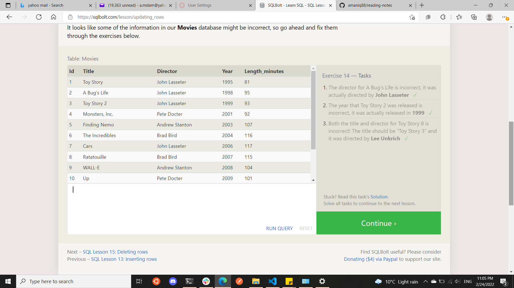
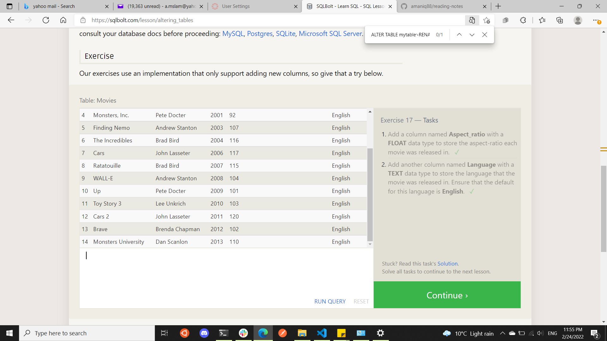

### Learn SQL 
SQL Lesson 1: SELECT queries 101
Select query for a specific columns

`SELECT columnName , another_column, …
FROM TableName;`

SQL Lesson 2: Queries with constraints (Pt. 1)

`Select query with constraints
SELECT column, another_column, …
FROM mytable
WHERE condition
    AND/OR another_condition
    AND/OR …;`

    

SQL Lesson 3: Queries with constraints (Pt. 2)
When writing WHERE clauses with columns containing text data, SQL supports a number of useful operators to do things like case-insensitive string comparison and wildcard pattern matching.

  

SQL Lesson 4: Filtering and sorting Query results
Select query with ordered results

`SELECT column, another_column, …
FROM mytable
WHERE condition(s)
ORDER BY column ASC/DESC;`

 

SQL Review: Simple SELECT Queries
TASK 

SQL Lesson 6: Multi-table queries with JOINs

Select query with INNER JOIN on multiple tables

`SELECT column, another_table_column, …
FROM mytable
INNER JOIN another_table 
    ON mytable.id = another_table.id
WHERE condition(s)
ORDER BY column, … ASC/DESC
LIMIT num_limit OFFSET num_offset;`

SQL Lesson 7: OUTER JOINs

Select query with LEFT/RIGHT/FULL JOINs on multiple tables

`SELECT column, another_column, …
FROM mytable
INNER/LEFT/RIGHT/FULL JOIN another_table 
    ON mytable.id = another_table.matching_id
WHERE condition(s)
ORDER BY column, … ASC/DESC
LIMIT num_limit OFFSET num_offset;`

SQL Lesson 8: A short note on NULLs

Select query with constraints on NULL values

`SELECT column, another_column, …
FROM mytable
WHERE column IS/IS NOT NULL
AND/OR another_condition
AND/OR …;`

SQL Lesson 9: Queries with expressions

you can also use expressions to write more complex logic on column values in a query. These expressions can use mathematical and string functions along with basic arithmetic to transform values when the query is executed

SQL Lesson 10: Queries with aggregates (Pt. 1)

SQL also supports the use of aggregate expressions (or functions) that allow you to summarize information about a group of rows of data

COUNT(*), COUNT(column)	
MIN(column)	
MAX(column)
AVG(column)
SUM(column)

SQL Lesson 11: Queries with aggregates (Pt. 2)

Select query with HAVING constraint

`SELECT group_by_column, AGG_FUNC(column_expression) AS aggregate_result_alias, …
FROM mytable
WHERE condition
GROUP BY column
HAVING group_condition;`

SQL Lesson 12: Order of execution of a Query

1. FROM and JOINs
2. WHERE
3. GROUP BY
4. HAVING
5. SELECT
6. DISTINCT
7. ORDER BY
8. LIMIT / OFFSET

SQL Lesson 13: Inserting rows

Insert statement with values for all columns

`INSERT INTO mytable
VALUES (value_or_expr, another_value_or_expr, …),
       (value_or_expr_2, another_value_or_expr_2, …),
       …;`

SQL Lesson 14: Updating rows

UPDATE mytable
SET column = value_or_expr, 
    other_column = another_value_or_expr, 
    …
WHERE condition;

SQL Lesson 15: Deleting rows

Delete statement with condition

`DELETE FROM mytable
WHERE condition;`

SQL Lesson 16: Creating tables

Create table statement w/ optional table constraint and default value

`CREATE TABLE IF NOT EXISTS mytable (
    column DataType TableConstraint DEFAULT default_value,
    another_column DataType TableConstraint DEFAULT default_value,
    …
);`

SQL Lesson 17: Altering tables

ALTER TABLE mytable
`ADD column DataType OptionalTableConstraint 
    DEFAULT default_value;`

SQL Lesson 18: Dropping tables

Drop table statement
`DROP TABLE IF EXISTS mytable;`

